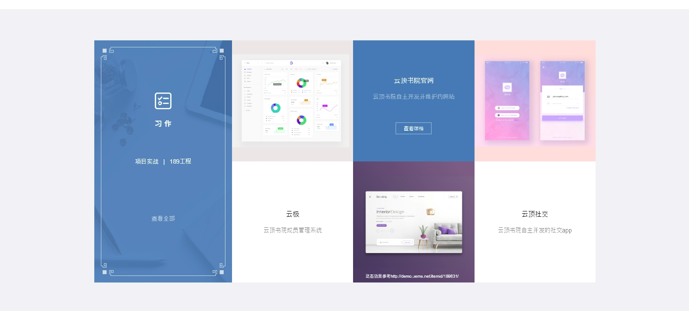
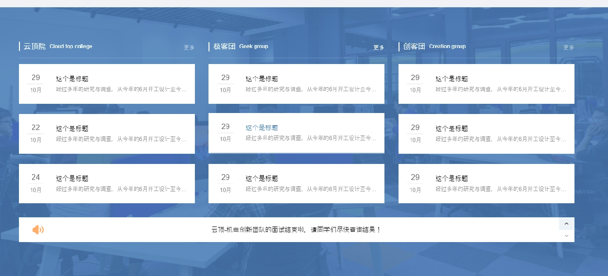
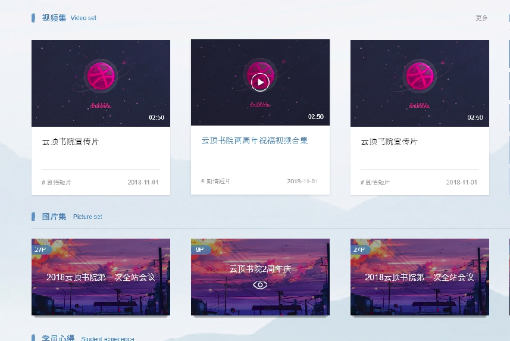
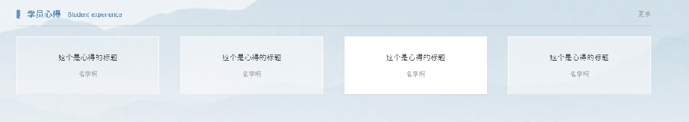

## 首页

####  轮播图

- 四篇轮播文章,具有封面.
- 权限:管理员
- 功能
  - ~~上传~~
  - ~~修改~~
  - 展示
  - ~~移除~~

#### 文章板块一

- 三类文章
- 权限:用户,管理员(**上传修改删除,用户与管理员各用一套** )
- 功能
  - ~~三类文章的首页展示(4篇)~~
  - 文章列表的展示(分页)
  - 详情展示
  - ~~上传~~
  - ~~修改~~
  - ~~删除~~

#### 习作

- 作品展示(**只有后台可以操作**)
- 权限:管理员
- 功能
  - ~~首页展示(3篇)~~
  - ~~上传~~
  - ~~修改~~
  - ~~删除~~

#### 文章板块二

- 相对正式的文章
- 权限:管理员
- 功能
  - 文章管理同文章板块的管理员接口,公用一套
  - 公告栏
    - ~~上传～～
    - ~~删除~~
    - 后台展示(分页)
    - ~~首页展示(3条轮播)~~

#### 视频集&&图集

- 视频与图片分别的展示
- 权限:管理员
- 功能(**不能共用的分开写**)
  - 首页展示
  - 列表展示
  - 上传
  - 修改
  - 删除
  - 后台展示(分页)

#### 学员心得

- 权限:用户,管理员
- 功能:
  - ~~首页展示~~
  - 心得列表展示
  - 上传删除修改同文章API
  - 后台管理同文章后台

## 文章

#### 评论

- 权限:用户
- 功能:
  - 评论的展示
  - 添加评论
  - 删除评论
  - 评论评论

#### 点赞

- 权限:用户
- 功能:
  - 点赞量,点赞状态的反馈
  - 添加点赞
  - 取消点赞

## 搜索

## 用户

#### 个人中心

- 功能:
  - 个人信息保存
  - 个人信息修改
  - 个人信息获取

#### 学员榜展示

- 功能:
  - 学员榜展示

#### 登录注册

